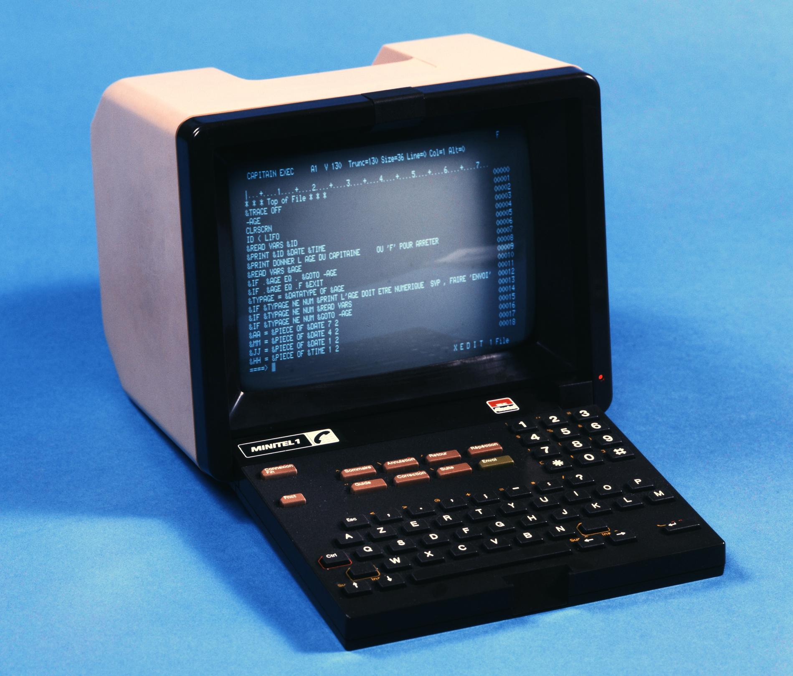

# Minitel

---

`Fnct+Sommaire` (pour passer du mode répertoire au mode terminal)

`Fnct+T` (en même temps), relâcher et `A` (passage en mode périphérique)

`Fnct+T`, (en même temps) et `E` (désactivation de l’echo du terminal)

`Fnct+P`, (en même temps), et `4` (connexion à 4800 bauds)

---

`Ctrl+1`  {

`Ctrl+2`  |

`Ctrl+3`  }

`Ctrl+4`  ~

`Ctrl+5`  '

`Ctrl+6`  _

#

`Fnct+1` F1

`Fnct+2` F2

...

`Fnct+0` F10

---

Avec le minitel 2, vous pouvez même vous connecter à 9600 bauds en tapant `Fnct+P`, (en même temps), et `9` (à la place de `4`), mais il faudra aussi modifier les paramètres du Raspberry Pi (ci-dessous).

## Test de communication

Branchez le minitel sur la prise USB du Raspberry Pi et allumez les. Connectez vous au Raspberry (avec PuTTY ou le client SSH de Windows).
Copiez ces 3 lignes en même temps dans votre client SSH :

> `stty -F /dev/ttyUSB0 4800 istrip cs7 parenb -parodd brkint \`
> 
> `ignpar icrnl ixon ixany opost onlcr cread hupcl isig icanon \`
> 
> `echo echoe echok`

> `echo 'Hello World' > /dev/ttyUSB0`

 Puis :

> `cat /dev/ttyUSB0`

## Ressources

- https://arduiblog.com/2019/04/29/ressuscitez-le-minitel/

- http://pila.fr/wordpress/?p=361

- http://sta6502.blogspot.com/2016/02/utiliser-un-minitel-comme-terminal-sur.html

- http://xseignard.github.io/2013/05/20/plug-your-minitel-on-your-raspberry-pi/

- http://furrtek.free.fr/?a=telinux

- https://www.synergeek.fr/recycler-un-minitel/

- http://lea-linux.org/documentations/Pratique-minitel

- https://www.framboise314.fr/retour-vers-le-passe/

- https://www.raspberrypi.org/forums/viewtopic.php?t=44932

- Starwars en ASCII :
`telnet towel.blinkenlights.nl`

- https://www.minitel.org/

- https://www.histelfrance.fr/page-5a854449a7560.html

- https://www.minitel-alcatel.fr/index.html

- https://alexxr6.fr/fr/posts/minitel-server/

- https://www.museeminitel.fr/

- https://serveur-minitel-2019-3615-iut-auxerre.webnode.fr/

- https://cq94.medium.com/re-creation-annuaire-electronique-minitel-fb59a843e86c

- https://www.minipavi.fr/

- https://fr.ulule.com/minimit/

- https://github.com/iodeo/Minitel-ESP32

- https://www.jelora.fr/post/2017/08/27/Serveur-Minitel.html

- https://fr.wikipedia.org/wiki/Minitel

- https://fr.wikipedia.org/wiki/Micro-serveur_Minitel

- https://github.com/bill-of-materials/awesome-minitel
